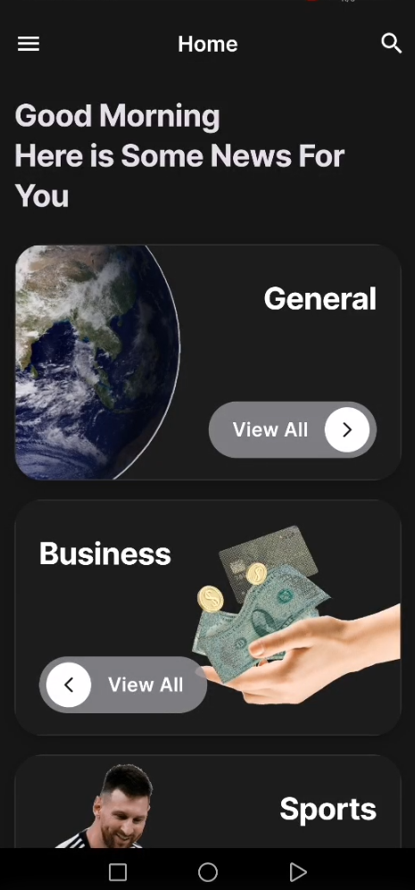
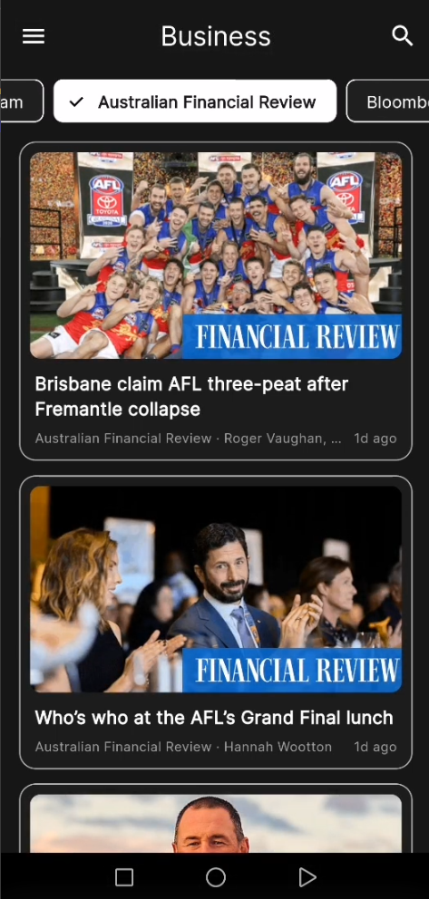
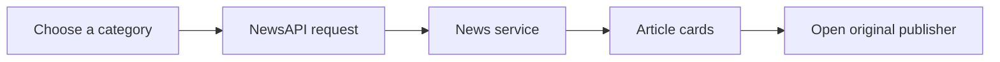

# 📰 News App

> One calm place to explore the stories shaping the day.

**News App** is a Flutter mobile reader that turns live NewsAPI headlines into a clean, category-first experience. Pick a topic, narrow it to a publisher, search for a story, then continue reading at the original source.

<p>
  
  
  
  
</p>

---

## The reading experience

<table>
  <tr>
    <td width="50%" align="center">
      
      <br /><br />
      <strong>Start with a subject</strong><br />
      Choose from seven illustrated categories, with a theme and language switcher always one tap away.
    </td>
    <td width="50%" align="center">
      
      <br /><br />
      <strong>Scan the latest headlines</strong><br />
      Each card puts the image, title, publisher, author, and publishing time in one easy-to-read view.
    </td>
  </tr>
  <tr>
    <td width="50%" align="center">
      
      <br /><br />
      <strong>Trust the sources you prefer</strong><br />
      Filter a category to one of its available publishers, or return to every source in a single tap.
    </td>
    <td width="50%" align="center">
      
      <br /><br />
      <strong>Read the full story at the source</strong><br />
      The app opens the original publisher page rather than duplicating the article content.
    </td>
  </tr>
</table>

---

## What you can do

| | Capability | Details |
| :---: | --- | --- |
| 🗂️ | **Explore categories** | General, Business, Sports, Technology, Science, Health, and Entertainment all have their own live feed. |
| 🏷️ | **Filter publishers** | See all headlines in a category or focus on one available source. |
| 🔎 | **Search the news** | Search recent articles by keyword or phrase. |
| ↗️ | **Continue reading** | Open any result at the publisher's original URL. |
| ↻ | **Stay current** | Pull down to refresh; more results load while you scroll. |
| 🌗 | **Make it yours** | Switch between dark and light mode, or English and Arabic with RTL support. |
| 🖼️ | **Browse reliably** | Article images are cached and gracefully fall back when unavailable. |

---

## How a headline reaches the screen



The app uses **top headlines** for category feeds, **available sources** for the publisher filter, and **article search** for keywords. It displays NewsAPI metadata and always leaves the full article with its publisher.

---

## Under the hood

| Area | Choice |
| --- | --- |
| Framework | [Flutter](https://flutter.dev/) · Dart SDK `^3.12.0` |
| News data | [NewsAPI](https://newsapi.org/) |
| Network client | [Dio](https://pub.dev/packages/dio) |
| Images | [cached_network_image](https://pub.dev/packages/cached_network_image) |
| Publisher links | [url_launcher](https://pub.dev/packages/url_launcher) |
| Interface | Material 3, [Google Fonts](https://pub.dev/packages/google_fonts), custom assets |

---

## Project map

```text
news/lib/
├── models/          # NewsArticle and NewsSource
├── screens/
│   ├── splash/      # Animated introduction
│   ├── home/        # Category discovery
│   ├── category/    # Headlines and publisher filter
│   └── search/      # Keyword search
├── services/        # Dio-powered NewsAPI client
├── utils/           # Theme, localization, routes, colors, and assets
├── widgets/         # Shared interface components
└── main.dart        # Application entry point
```

---

## Run it locally

### You will need

- [Flutter SDK](https://docs.flutter.dev/get-started/install)
- Android Studio or VS Code with Flutter and Dart support
- A [NewsAPI key](https://newsapi.org/register)

### Setup

```bash
git clone https://github.com/rwasei74/News.git
cd News/news
flutter pub get
```

Create `api_keys.json` in the `news` directory from `api_keys.example.json`:

```json
{
  "NEWS_API_KEY": "your-newsapi-key"
}
```

Then run:

```bash
flutter run --dart-define-from-file=api_keys.json
```

The included **News App (development)** configuration works with Android Studio and VS Code, so once selected you can use the regular Run button.

## Keeping keys safe

Your real key belongs only in `news/api_keys.json`. That file is ignored by Git; `api_keys.example.json` is the safe template that stays in the repository.

> NewsAPI's free Developer plan is intended for development and testing. Use a suitable production plan or a protected backend proxy before releasing the app.

---

## Author

Built with ❤️ by [**rwasei74**](https://github.com/rwasei74)
